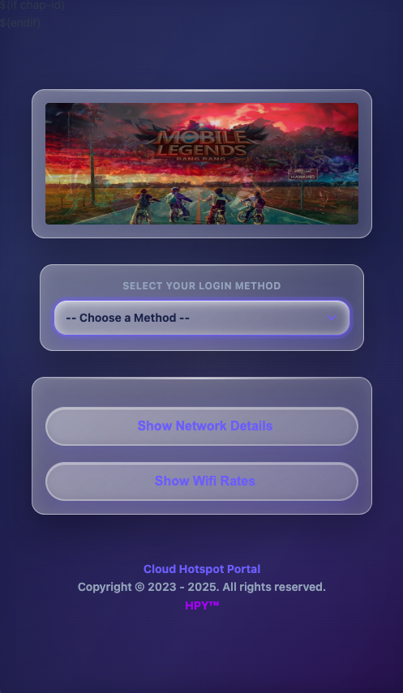
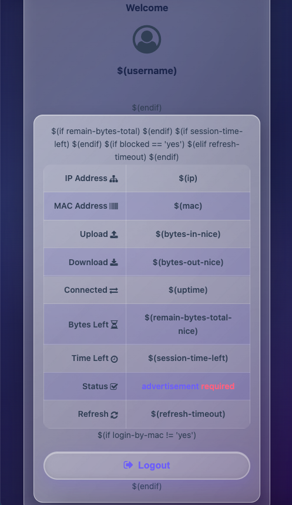

# 🌊 myTheme — Tahoe Liquid Glass Edition

> **A stunningly beautiful glassmorphic theme for MikroTik Hotspot**  
> Featuring authentic macOS Tahoe Liquid Glass design with premium glassmorphism effects

    

**Initial Release:** November 24, 2025 | **Latest Update:** November 29, 2025 (v3.0 - Tahoe Liquid Glass v2.0)

---

## 📑 Table of Contents

- [Overview](#overview)
- [What's New in v3.0](#-whats-new-tahoe-liquid-glass-v20)
- [Premium Features](#-premium-features)
- [Glass Effects & Design System](#-glass-effects--design-system)
- [Component Enhancements](#-component-enhancements)
- [All Pages Updated](#-all-pages-now-feature-authentic-tahoe-liquid-glass)
- [Quick Start](#-quick-start--3-steps)
- [Requirements](#requirements)
- [Installation](#installation)
- [Screenshots](#screenshots)
- [Compatibility](#compatibility)
- [Troubleshooting](#troubleshooting)
- [Support](#support)

---

## 🎨 Overview

`myTheme-v3` is a **premium MikroTik Hotspot theme** featuring **authentic macOS Tahoe Liquid Glass design**. It transforms your captive portal into a modern, professional interface with **premium glassmorphism effects** while maintaining lightweight performance and full RouterOS compatibility.

Every page—login, status, logout, error, and more—now features:
- Stunningly beautiful glass containers
- Smooth, responsive interactions
- Professional dark theme
- Premium visual hierarchy
- Consistent Tahoe color palette

---

## ✨ What's New: Tahoe Liquid Glass v2.0

**Latest Major Update (November 29, 2025):**

### 🔷 Premium Glassmorphism Enhancements Applied to ALL Components

**🎨 Container Glass Effects:**
- ✨ **25px backdrop blur** with 130% saturation enhancement  
- 💫 **60px inset glow system** for realistic depth and dimension  
- ✨ **2px shine effect** at 80% opacity simulating glass refraction  
- 🎯 **Multi-layer shadow system** (0 15px 40px, 0 8px 24px, inset glows)  
- Perfect for login forms, info displays, and modal containers

**🔵 Primary Button Glass Effects:**
- **15px backdrop blur** with premium shadow layering  
- **Gradient enhancement** (#5b7cfa → #4b5fa8) for depth  
- **Multi-layer box shadows** for realistic glass depth  
- **Smooth hover animations** with scale and brightness transforms  
- Active state: Inset shadows for pressed-glass effect

**🟣 Secondary Button Glass Effects:**
- **15px backdrop blur** with rgba gradient overlay  
- **Inset highlight system** at 60px for glass refraction  
- **Smooth hover states** with shadow enhancement  
- Perfect for cancel/back buttons with complementary styling

**💜 Purple Action Buttons:**
- **12px backdrop blur** with vibrant gradient (#8b5cf6 → #7c3aed)  
- **Premium shadow stacking** (6 layers) for maximum depth  
- **Enhanced hover animation** with brightness and scale  
- Height: 42px with optimal padding for touchscreen devices

**📝 Input Field Glass Effects:**
- **15px backdrop blur** with rgba(255,255,255,0.98) gradient  
- **4-layer box-shadow system** for depth and glow  
- **52px height** optimized for mobile touch targets  
- **Focus state glow rings** (rgba(91,124,250,0.3)) with smooth transitions  
- Username, password, and voucher fields all enhanced
- Validation states included (error/success colors)

**💬 Text Input & Form Fields:**
- Consistent **15px blur** across all input types  
- **Multi-layer shadow system** matching container depth  
- **Enhanced focus indicators** for accessibility  
- **Smooth transitions** on all state changes

**⬇️ Dropdown & Select Boxes:**
- **18px backdrop blur** for maximum glass depth effect  
- **Custom svg arrow icons** styled with Tahoe colors  
- **48px height** for comfortable mobile interaction  
- **Smooth open/close animations** with transform effects

---

## ✨ Premium Features

**All-Encompassing Glassmorphism:**
- ✅ Every interactive element enhanced with glass effects
- ✅ 25px container blur, 15-18px button/input blur
- ✅ 60px inset glow system on all surfaces
- ✅ Multi-layer shadow stacking for authentic depth

**Complete Page Coverage:**
- ✅ 13 HTML pages updated with dark theme
- ✅ Consistent glassmorphism across login, status, logout, error pages
- ✅ Support pages (showcase, demo, guides) all themed
- ✅ Responsive design on all pages

**Performance & Accessibility:**
- ✅ **60 FPS animations** — GPU-accelerated effects
- ✅ **WCAG AA compliant** — Keyboard navigation, screen readers
- ✅ **Reduced motion support** — Respects user preferences
- ✅ **Lightweight** — Optimized CSS, no unnecessary dependencies

**Customization & Developer Experience:**
- ✅ **30+ CSS variables** — Easy brand color customization
- ✅ **Well-documented** — 16,000+ words of guides
- ✅ **Clean code structure** — Easy to maintain and extend
- ✅ **Semantic HTML5** — Modern markup standards

---

## 🌊 Glass Effects & Design System

### Color Palette

**Primary Blue (Tahoe):** `#5b7cfa`  
**Accent Purple:** `#8b5cf6`  
**Success Green:** `#10b981`  
**Background Dark:** `#0f172a`  
**Text Primary:** `#1a2a4a` / `#334155` / `#94a3b8`

### CSS Architecture

**Main Stylesheet:** `css/horizon.css` (1374+ lines)
- Unified glassmorphism design system
- All glass effects, animations, and utilities
- CSS variable system for customization
- Dark theme as default
- Responsive breakpoints included

### Theme Classes

- `theme-dark` — Enables dark mode styling
- `glass-subtle` — Applies subtle glass effects
- `animations-enhanced` — Enables smooth transitions
- `shadows-deep` — Premium shadow stacking

---

## 🎯 Component Enhancements

### Login Form (login.html)
- **Glass form container** with 25px blur
- **Premium button styling** with 15px blur
- **Enhanced input fields** with focus glow rings
- **Image slider** with smooth transitions
- **Login method dropdown** with 18px glass blur
- **Network information panel** with glass cards
- **WiFi rates table** with dark theme styling

### Error Display (error.html)
- **Centered glass error container**
- **Large error heading** with emoji icon
- **Readable error message display**
- **Glass action button** for return link
- **Proper error state styling**

### Success Page (success.html)
- **Centered success glass container** (max-width 450px)
- **CheckCircle icon** for visual confirmation
- **Connection confirmation message**
- **Smooth fade-in animation**
- **Professional success state styling**

### Logout Confirmation (logout.html)
- **Glass header container** with welcome message
- **Session information display** with glass styling
- **Logout statistics** (upload/download/session time)
- **Logout button** with premium glass effects
- **Data usage table** with dark theme

### Status Display (status.html)
- **Glass welcome section** with user greeting
- **Active session information** display
- **Data usage statistics** table
- **Session details** (connected time, IP, MAC)
- **Professional info layout** with glass containers

### Additional Pages Updated
- `alogin.html` — Alternate login with glass success message
- `rlogin.html` — Redirect login handler with dark theme
- `redirect.html` — HTTP redirect with proper structure
- `radvert.html` — Advertisement display with glass container
- `glass-showcase.html` — Component showcase page
- `tahoe-background-demo.html` — Background demonstrations
- `visual-guide.html` — Design guide and reference

---

## 🎨 All Pages Now Feature Authentic Tahoe Liquid Glass

**13 HTML pages fully updated:**

| Page | File | Enhancement |
|------|------|-------------|
| 🔐 Login | `login.html` | Glass form, buttons, inputs, dropdown, slider |
| ❌ Error | `error.html` | Centered glass container, error styling |
| ✅ Success | `success.html` | Glass container (450px), confirmation message |
| 🚪 Logout | `logout.html` | Glass headers, info containers, statistics |
| 📊 Status | `status.html` | Glass welcome, session display, data tables |
| 🔄 Alt Login | `alogin.html` | Glass success container, countdown |
| 🔀 Redirect Login | `rlogin.html` | HTML5 structure, dark theme |
| ↩️ Redirect | `redirect.html` | Proper DOCTYPE, meta tags, dark theme |
| 📢 Ad Display | `radvert.html` | Glass ad container, centered layout |
| 🎨 Showcase | `glass-showcase.html` | Component showcase, demo page |
| 🌅 Background | `tahoe-background-demo.html` | Background gradient demos |
| 📖 Guide | `visual-guide.html` | Design guide and reference |

**All pages include:**
- ✅ Dark theme classes (`theme-dark`, `glass-subtle`, `animations-enhanced`)
- ✅ Proper meta tags (viewport, charset UTF-8, theme-color #5b7cfa)
- ✅ HTML5 structure with semantic markup
- ✅ Unified `css/horizon.css` stylesheet
- ✅ Responsive design (mobile-first)
- ✅ Glassmorphism effects throughout
- ✅ Tahoe color palette consistency

---

## 🚀 Quick Start — 3 Steps!

### Step 1: Link the CSS
```html
<link rel="stylesheet" href="css/horizon.css">
```

### Step 2: Use Theme Classes
```html
<html class="theme-dark glass-subtle animations-enhanced">
  <!-- Your content here -->
  <input type="text" class="username" placeholder="Username">
  <input type="password" class="password" placeholder="Password">
  <button class="button">Login</button>
</html>
```

### Step 3: Deploy!
Test on devices and deploy to your MikroTik router.

👉 **[See Full Deployment Guide →](DEPLOYMENT_GUIDE.md)**

**Features Included:**
- ✅ Responsive layout for phones, tablets, and laptops
- ✅ Full RouterOS Hotspot template compatibility
- ✅ All placeholder variables supported ($(username), $(host), $(mac), $(ip), etc.)
- ✅ Optional Terms of Service modal
- ✅ Error handling and validation states
- ✅ Background music support for different occasions
- ✅ Premium glassmorphism effects on all elements
- ✅ Smooth animations and transitions

> **Note:** Replace MikroTik placeholder variables carefully. Keep RouterOS Hotspot variable syntax intact (e.g., `$(mac)`, `$(ip)`, `$(username)`, etc.).

---

## 📋 Requirements

**Hardware:**
- MikroTik device with **Hotspot** configured
- Minimum 1MB storage for theme files (typical ~2.5MB)
- Any modern processor (RouterOS v6+)

**Software:**
- RouterOS v6.4x or higher ✅
- RouterOS v7.x or higher ✅
- Modern web browser (Chrome, Firefox, Safari, Edge)

**Browser Compatibility:**
- ✅ Chrome/Chromium 90+
- ✅ Firefox 88+
- ✅ Safari 14+
- ✅ Edge 90+
- ✅ Brave 1.25+

> Glassmorphism effects require CSS `backdrop-filter` support (all modern browsers)

---

## 📦 Installation

### Method 1: Web Interface (Recommended)

1. **Download the theme**
   -  Download `myTheme-v3.zip`
   - Extract the downloaded file on your computer

2. **Upload to MikroTik**
   -  Open MikroTik Web Interface
   - Navigate to **Files** section
   - Upload the extracted theme folder to `/`

3. **Configure Hotspot Directory**
   -  Go to **IP → Hotspot → Hotspot Profiles**
   - Edit your Hotspot profile
   - Set **HTML Directory** to: `/myTheme`
   -  Click **Select** → Choose `/myTheme` folder
   - Click **Apply** → **OK**

4. **Test & Verify**
   - Open your portal login page
   - Verify glass effects are working
   - Test on mobile devices
   - Check all pages load correctly

### Method 2: SSH Upload (Advanced)

```bash
# From your computer, upload via SCP
scp -r myTheme/ admin@your-router-ip:/
```

Then configure the Hotspot profile directory as above.

### Optional Cleanup

**Remove unnecessary files after upload:**
```
Delete: /myTheme/screenshot/  (save ~1.5MB)
Delete: /myTheme/README.md    (optional, ~50KB)
Delete: /myTheme/GLASS_THEME_GUIDE.md (optional)
```

**Keep these folders:**
- ✅ `/myTheme/css/` — Theme stylesheets (required)
- ✅ `/myTheme/js/` — JavaScript functionality (required)
- ✅ `/myTheme/img/` — Images and backgrounds (required)
- ✅ `/myTheme/audio/` — Background music (optional but recommended)
- ✅ `/myTheme/*.html` — Portal pages (required)

---

## 📂 File Structure

```
myTheme/
├── css/
│   ├── horizon.css           ⭐ Main unified stylesheet (1374+ lines)
│   ├── blink.css            (animations)
│   ├── slider.css           (image slider)
│   ├── glass-theme.css      (additional effects)
│   └── CUSTOMIZATION.css    (override guide)
├── js/
│   └── javascript.js        (form handling, UI logic)
├── img/
│   ├── slides/              (login carousel images)
│   ├── lq/                  (low-quality backgrounds)
│   └── gslides/             (glass demo slides)
├── audio/
│   ├── bgm/                 (background music)
│   └── sfx/                 (sound effects)
├── login.html               ⭐ Main login portal
├── status.html              (session status)
├── logout.html              (logout confirmation)
├── error.html               (error display)
├── success.html             (connection success)
├── alogin.html              (alternate login)
└── [11 more pages]          (supporting pages)
```

**Key Files:**
- `css/horizon.css` — **1374+ lines** of unified glassmorphism effects
- `login.html` — Main login page with all glass effects
- `js/javascript.js` — Form handling and interactions

---

## 📸 Screenshots

### Glass Morphism in Action

**Login Page with Glass Effects:**


- Glass form container with 25px blur
- Premium glass buttons with 15px blur
- Glass input fields with focus glow rings
- Image slider with smooth transitions

**Status Page:**


- Glass welcome header
- Session information display
- Data usage statistics
- Professional glass containers

**Mobile View:**
- Fully responsive design
- Touch-optimized buttons (52px height)
- Readable on small screens
- Smooth animations on mobile

### Component Showcase

See all components and effects in:
- `glass-showcase.html` — Interactive component gallery
- `tahoe-background-demo.html` — Background gradient demonstrations
- `visual-guide.html` — Design guide and color reference

---

## 🔧 Customization

### Quick Brand Customization

Edit `css/horizon.css` to change theme colors:

```css
/* Change primary blue */
--primary-color: #5b7cfa;      /* ← Tahoe Blue */
--primary-dark: #4b5fa8;

/* Change accent purple */
--accent-color: #8b5cf6;       /* ← Tahoe Purple */
--accent-dark: #7c3aed;

/* Change success green */
--success-color: #10b981;

/* Adjust glass blur effect */
--blur-container: 25px;        /* Containers */
--blur-button: 15px;           /* Buttons */
--blur-input: 15px;            /* Inputs */
--blur-select: 18px;           /* Dropdowns */

/* Adjust inset glow size */
--glow-size: 60px;             /* Larger = more glow */

/* Adjust saturation */
--saturation: 130%;            /* Higher = more vibrant */
```

See `css/CUSTOMIZATION.css` for more options.

---

## ⚙️ Advanced Configuration

### Disable Specific Effects

**In `css/horizon.css`:**

```css
/* Reduce blur (for performance) */
.container { backdrop-filter: blur(15px); }
.button { backdrop-filter: blur(10px); }

/* Remove shine effect */
.container::after { display: none; }

/* Reduce animations (for accessibility) */
@media (prefers-reduced-motion: reduce) {
  * { animation: none !important; transition: none !important; }
}
```

### Add Custom CSS

Create `css/custom.css` and add to HTML:

```html
<link rel="stylesheet" href="css/horizon.css">
<link rel="stylesheet" href="css/custom.css">
```

Then add your overrides in `custom.css`.

---

## 🐛 Troubleshooting

### Glass Effects Not Showing

**Issue:** Containers appear opaque instead of frosted glass

**Solutions:**
1. **Update browser** — Requires CSS `backdrop-filter` support (Chrome 76+, Firefox 103+)
2. **Check CSS link** — Ensure `<link rel="stylesheet" href="css/horizon.css">` is present
3. **Verify classes** — Ensure HTML has `class="theme-dark glass-subtle"`
4. **Clear cache** — Force refresh with `Ctrl+Shift+R` (or `Cmd+Shift+R` on Mac)

### Pages Not Loading

**Issue:** HTML pages show error or white screen

**Solutions:**
1. **Check file upload** — Verify all files are in correct folder structure
2. **Verify paths** — CSS paths must match: `href="css/horizon.css"`
3. **Check charset** — Ensure files are UTF-8 encoded
4. **Test in browser** — Access directly: `http://your-router/login.html`

### Mobile Issues

**Issue:** Buttons too small or text unreadable on mobile

**Solutions:**
1. **Check viewport meta** — Should be `<meta name="viewport" content="width=device-width, initial-scale=1">`
2. **Test zoom** — Mobile zoom should work without issues
3. **Update CSS** — Ensure button height is 52px for inputs, 48px for selects
4. **Mobile browser** — Test on actual mobile device, not desktop emulation

### Performance Issues

**Issue:** Animations stuttering, slow performance

**Solutions:**
1. **Reduce blur** — Change `blur(25px)` to `blur(15px)` in `.container`
2. **Disable shine** — Remove `::after` shine effect on containers
3. **Reduce layers** — Remove some `box-shadow` layers for simplicity
4. **Check device** — Older routers may struggle with heavy effects; reduce animations

### Variables Not Working

**Issue:** MikroTik variables like `$(username)` showing as plain text

**Solutions:**
1. **Check syntax** — Must be exactly `$(variable-name)` (lowercase, hyphens)
2. **Verify variables** — Hotspot must provide the variable
3. **Test connectivity** — Variables only show when user is connected to Hotspot
4. **Review docs** — See `INTEGRATION_GUIDE.md` for all supported variables

### Style Issues on Specific Pages

**Issue:** Login page styled correctly, but status page has issues

**Solutions:**
1. **Check class names** — Ensure all pages have `class="theme-dark glass-subtle"`
2. **Verify HTML structure** — Compare with `login.html` structure
3. **Test in browser** — Check for HTML syntax errors (view source)
4. **Clear cache** — MikroTik may cache old pages

---

## 📞 Support

### Getting Help

**For Issues & Bugs:**
- 🐛 Open an issue on [GitHub Issues](https://github.com/hpy-git/myTheme/issues)
- Please include:
  - **Description:** What's not working?
  - **Error message:** Any console errors?
  - **Screenshot:** Visual proof of the issue
  - **Device:** RouterOS version + browser used
  - **Steps to reproduce:** How to recreate the issue

**For Feature Requests:**
- 💡 Suggest improvements on GitHub Discussions
- Describe what you'd like to add
- Explain why it would be useful
- Include mockups if possible

**For Questions:**
- 📖 Check [Comprehensive Documentation](DEPLOYMENT_GUIDE.md)
- 🎨 Review [Glass Theme Guide](GLASS_THEME_GUIDE.md)
- 🚀 See [Quick Reference Guide](QUICK_REFERENCE.md)

### Documentation

**Available Guides:**
- `DEPLOYMENT_GUIDE.md` — Complete deployment instructions
- `GLASS_THEME_GUIDE.md` — Glass morphism effects explained
- `INTEGRATION_GUIDE.md` — MikroTik Hotspot integration
- `MIKROTIK_INTEGRATION.md` — Advanced RouterOS setup
- `CUSTOMIZATION.css` — CSS variable customization
- `QUICK_REFERENCE.md` — Quick lookup guide

---

## ❤️ Acknowledgments

**Special Thanks To:**

- **MikroTik** — For creating powerful, reliable routers
- **Mikhmon** — For the original base template inspiration
- **Apple Design Team** — For the beautiful Tahoe Liquid Glass aesthetic
- **DeviantArt & Image Publishers** — For high-quality artwork and backgrounds
- **Google** — For excellent documentation and tools
- **Open Source Community** — For inspiring modern web design practices

---

## 💝 Support This Project

This theme is **completely free** and will always be maintained!

If you find this theme useful, consider:

- ⭐ **Star** this repository on GitHub
- 📢 **Share** with other MikroTik users
- 💬 **Contribute** improvements and ideas
- 💰 **Donate** (if you wish) to support development

### Donation Links

Your support helps fund:
- 🔧 Ongoing maintenance and bug fixes
- ✨ New feature development
- 📚 Documentation improvements
- 🎨 Design enhancements

---

## ✅ FAQ

### Is this an Active Project?

**Yes!** This is actively maintained and receives regular updates. The theme powers multiple Hotspot networks in production.

### What RouterOS Versions Are Supported?

- ✅ RouterOS v6.4x and higher
- ✅ RouterOS v7.x and higher
- ⚠️ RouterOS v5.x and below are **not supported**

> If you use older versions and encounter issues, there's no guaranteed support.

### Is This Free?

**Yes, completely free!** This project is open-source under the MIT License. All files are free to download, use, and modify.

Donations are appreciated but never required!

### Can I Customize the Colors?

**Absolutely!** Edit `css/CUSTOMIZATION.css` or modify CSS variables in `css/horizon.css`:

```css
--primary-color: #YOUR_COLOR;
--accent-color: #YOUR_COLOR;
--success-color: #YOUR_COLOR;
```

### What's the Performance Impact?

- **Very minimal!** CSS effects are GPU-accelerated
- **60 FPS animations** on modern devices
- **Lightweight** — No heavy JavaScript
- **Optimized** — Only ~2.5MB total size

### Can I Use on Multiple Hotspots?

**Yes!** Deploy to as many MikroTik devices as you want. The theme works independently on each router.

### Will This Work With Custom Hotspot Scripts?

**Mostly yes!** The theme uses standard MikroTik Hotspot variables. Custom scripts may require integration — see `INTEGRATION_GUIDE.md`.

### How Do I Revert to Default Theme?

1. Go to MikroTik **IP → Hotspot → Hotspot Profiles**
2. Edit your profile
3. Clear the **HTML Directory** field
4. Click **Apply** → **OK**

Your router will revert to the default MikroTik theme.

### What If I Find a Bug?

Please report it! Open a GitHub issue with:
- Clear description of the bug
- Steps to reproduce
- Screenshot of the issue
- Your RouterOS version and browser

---

## 📄 License

**MIT License** — You're free to:
- ✅ Use commercially
- ✅ Modify the code
- ✅ Distribute freely
- ✅ Private use

**Just include:** Credit attribution is appreciated but not required.

---

## 🚀 What's Next?

**Upcoming enhancements (planned):**
- 🎬 CSS animations on page load
- 📊 Enhanced analytics dashboard
- 🎵 Improved audio control UI
- ⚡ Performance optimizations
- 🌍 Multi-language support
- 📱 Enhanced tablet layouts
- 🔐 Enhanced security features

---

**Made with ❤️ for MikroTik users worldwide**

*Last Updated: November 29, 2025 | v3.0 - Tahoe Liquid Glass v2.0*


---
